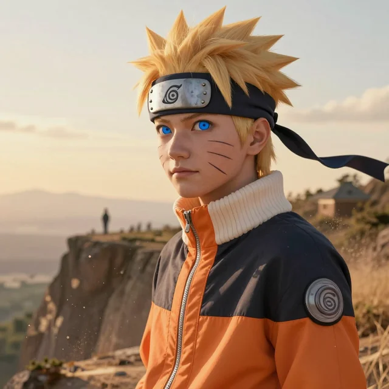
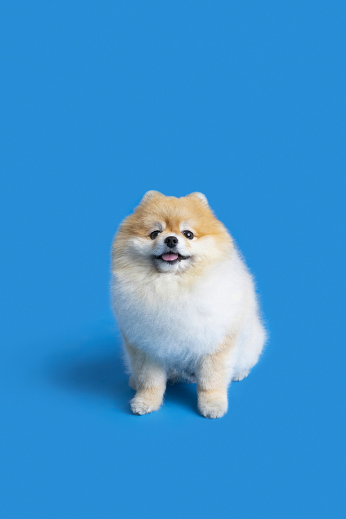

## 만화 같은 느낌이 잘 표현되는 이미지 데모

평탄화된 색상 : 피부와 옷감의 명암이 단순화되어 수채화나 마커로 칠한 듯한 느낌을 줍니다.

굵은 외각선 : 외각선을 굵게 극대화하여 더욱 만화 캐릭터같은 느낌을 줍니다.

## 만화 같은 느낌이 잘 표현되지 않은 이미지 데모

강아지의 털의 질감이 매우 세밀하고 복잡하여 좁은 영역 안에서도 털 그림자에 의한 미세한 명암 대비가 끊임없이 발생합니다. 따라서 medianBlur를 통해 노이즈 감소 전처리를 수행했음에도 불구하고 노이즈가 많이 발생했습니다.

## 구현한 알고리즘의 한계점
### 파라미터 의존성 및 범용성 부족
엣지의 민감도를 조절하는 blockSize와 C 값, 그리고 전처리 과정인 cv2.medianBlur의 커널 크기 등을 특정 이미지에 최적화하면, 질감 분포가 다른 이미지에서는 결과가 심각하게 훼손됩니다. 즉, 한 번의 실행으로 모든 해상도나 복잡도를 가진 사진에 완벽하게 적용되는 범용적인 파라미터를 찾기 어려우며, 사진의 특성에 따라 매번 수동으로 수치를 튜닝해야 한다는 한계가 있습니다.

### 형태학적 연산의 부작용
추출된 스케치 선을 만화의 펜 터치처럼 굵고 힘 있게 만들고 자잘한 노이즈를 억제하기 위해 형태학적 연산 중 침식 연산을 적용했습니다. 이로 인해 굵은 뼈대 선이 강조되는 긍정적 효과를 얻었으나, 동시에 눈동자의 세밀한 묘사나 얇게 유지되어야 할 머리카락 끝부분의 섬세한 선들까지 뭉툭해지거나 인접한 선들과 강제로 병합되어 디테일이 손실되는 부작용이 발생했습니다.